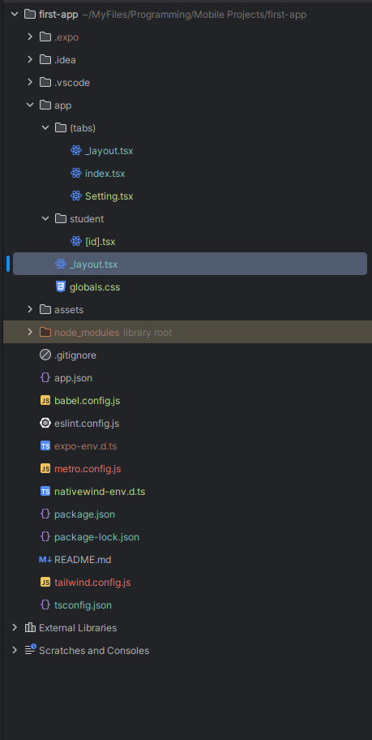

# learn-reactNative
## To Reset Your Project Run 

# (First You Must Setup the Nativewind in the project the steps in the pdf)⭐.

> This Will Delete all the code come with the project in first init and return it to be clean to code

```bash

npm run reset-project

```


> This will run project and remove the cash

```bash

 npx expo start --clear

```

## To make normal page with routing in app folder -> index.tsx :

> ``` index.tsx ``` Page

```tsx

import { Text, View } from "react-native";
import {Link} from "expo-router";

export default function Index() {
  return (
    <View className='w-full h-full flex justify-start items-center'>
        <View
            className='w-full h-full flex items-center justify-center'
        >
            <Text>Edit app/index.tsx to edit this screen.</Text>
            <Link
                className='px-8 py-3 bg-gray-400/20 border-2 border-gray-400 mt-4 rounded-md'
                href='/Setting'>
                Setting Page
            </Link>
        </View>
    </View>
  );
}

```

> ``` Setting.tsx ``` Page

```tsx

import React from 'react';
import {View , Text} from 'react-native';

function Setting(){
    return(
        <>
            <View>
                <Text>
                    Setting Page
                </Text>
            </View>
        </>
    )
}

export default Setting;


```


## We can make Dynamic Page Easily with React Native because it use as same as way in the next js in the project 

<ul>
  <li>
    app
  </li>
  <ul>
    <li>
      student
      <ul>
        <li>
          [id].tsx
        </li>
      </ul>
    </li>
    <li>
      index.tsx
    </li>
    <li>
      setting.tsx
    </li>
  </ul>
</ul>


> ``` student/[id].tsx ``` Page

```tsx

import {View, Text} from 'react-native'
import React from 'react'
import {useLocalSearchParams} from "expo-router";

export default function Students() {
    const {id} = useLocalSearchParams();

    return (
        <View>
            <Text>
                Welcome Student : {id}
            </Text>
        </View>
    )
}


```

> ``` index.tsx ``` Page


```tsx

import {Text, View} from "react-native";
import {Link} from "expo-router";

export default function Index() {
    return (
        <View className='w-full h-full flex justify-start items-center'>
            <View
                className='w-full h-full flex items-center justify-center'
            >
                <Text>Edit app/index.tsx to edit this screen.</Text>
                <Link
                    className='px-8 py-3 bg-gray-400/20 border-2 border-gray-400 mt-4 rounded-md'
                    href='/Setting'>
                    Setting Page
                </Link>
                <Link
                    className='px-8 py-3 bg-gray-400/20 border-2 border-gray-400 mt-4 rounded-md'
                    href='../student/Muhammed'>
                    Student Muhammed
                </Link>
            </View>
        </View>
    );
}


```


# Navigation

> To make Navigation in the app we must group the pages in group folder like ``` (tabs) ``` , within tabs folder we must put ``` _layout.tsx ``` file that return the ``` <Stack /> ```



> ``` app/(tabs)/_layout.tsx ``` Page


```tsx

import {StyleSheet, Text, View} from 'react-native'
import React from 'react'
import {Stack, Tabs} from "expo-router";

const _Layout = () => {
    return (
        <Tabs>
            <Tabs.Screen
                name='index'
                options={{
                    headerShown: false,
                }}
            />

            <Tabs.Screen
                name='Setting'
                options={{
                    headerShown: false,
                }}
            />

        </Tabs>
    )
}
export default _Layout
const styles = StyleSheet.create({})


```

## To hidden the upper bar we gone to make this throw change the [_layout.tsx] files in the app directory & in the (tabs) directory :

> ``` app/(tabs)/_layout.tsx ``` Page


```tsx

import {StyleSheet, Text, View} from 'react-native'
import React from 'react'
import {Stack, Tabs} from "expo-router";

const _Layout = () => {
    return (
        <Tabs>
            <Tabs.Screen
                name='index'
                options={{
                    headerShown: false,
                }}
            />

            <Tabs.Screen
                name='Setting'
                options={{
                    headerShown: false,
                }}
            />

        </Tabs>
    )
}
export default _Layout
const styles = StyleSheet.create({})


```


> ``` app/_layout.tsx ``` Page


```tsx

import {Stack, Tabs} from "expo-router";
import './globals.css';
import React from "react";

export default function RootLayout() {
    return(
        <Stack>
            <Stack.Screen
                name='(tabs)'
                options={{
                    headerShown: false,
                }}
            />

            <Stack.Screen
                name='student/[id]'
                options={{
                    headerShown: false,
                }}
            />
        </Stack>
    );
}

```

> in the app we define the every folder we have as screen and in the the inner layout we define every file as screen


# To make Linear Gradient in React Native it Didn't Support it but we can use expo lib in it that can easily add the gradient we want to make just follow this simple code 

## First We need to install this expo lib from expo using the npx 

```bash

npx expo install expo-linear-gradient


```

## then we can use it easily ( code ) :

```tsx

import React from 'react'
import {Tabs} from "expo-router";
import { LinearGradient} from "expo-linear-gradient";
import {icons} from "@/constants/icons";
import {Image, Text, View} from "react-native";

const _Layout = () => {
    return (
        <Tabs>
            <Tabs.Screen
                name='index'
                options={{
                    title: 'Home',
                    headerShown: false,
                    tabBarShowLabel: false,
                    tabBarIcon: ({focused}) => (
                        <>
                            <LinearGradient
                                colors={['#E9D5FF','#C084FC']}
                                start={{ x: 0 , y: 0}}
                                end={{ x: 1, y: 1 }}
                                className='w-full min-h-14 min-w-[112px] flex flex-row items-center justify-center gap-2 rounded-full
                                    overflow-hidden bg-gradient-to-r from-purple-200 to-purple-400'
                            >
                                <Image
                                    source={icons.home}
                                    tintColor="#000000"
                                    className={'size-5'}
                                />
                                <Text>
                                    Home
                                </Text>
                            </LinearGradient>
                        </>
                    )
                }}
            />

            <Tabs.Screen
                name='Search'
                options={{
                    headerShown: false,
                }}
            />

            <Tabs.Screen
                name='Setting'
                options={{
                    headerShown: false,
                }}
            />

        </Tabs>
    )
}
export default _Layout


```


### Explain of x and y why it's 0 and 1 :

```lua

(0,0)          (1,0)
  +--------------+
  |              |
  |              |
  +--------------+
(0,1)          (1,1)


```

## Example on Full _layout.tsx page of grouping pages to make navigation


```tsx


import React from 'react'
import {Tabs} from "expo-router";
import {LinearGradient} from "expo-linear-gradient";
import {icons} from "@/constants/icons";
import {Image, Text, View} from "react-native";


const _Layout = () => {

    const BarButton = ({focused, title, icon}: any) => {
        if (focused) {
            return (
                <>
                    <LinearGradient
                        colors={['#bfa6e0', '#9f5fe5']}
                        start={{x: 0, y: 0}}
                        end={{x: 1, y: 0}}
                        className='w-full min-h-16 min-w-[100px] flex flex-row items-center justify-center gap-2 rounded-full
                                    overflow-hidden mt-4'
                    >
                        <Image
                            source={icon}
                            tintColor="#0f0d23"
                            className={'size-5'}
                        />
                        <Text className={'text-[0.9rem] text-[#0f0d23]'}>
                            {title}
                        </Text>
                    </LinearGradient>
                </>
            )
        }

        return (
            <>
                <View
                    className='w-full min-h-16 min-w-[112px] flex flex-row items-center justify-center gap-2 rounded-full
                                overflow-hidden mt-4'
                >
                    <Image
                        source={icon}
                        tintColor="#E2E0EEFF"
                        className={'size-5'}
                    />
                </View>
            </>
        )
    }

    return (
        <Tabs
            screenOptions={{
                tabBarShowLabel: false,
                tabBarItemStyle: {
                    width: '100%',
                    height: '100%',
                    justifyContent: 'center',
                    alignItems: 'center',
                },
                tabBarStyle: {
                    backgroundColor: '#0f0d23',
                    marginBottom: 36,
                    marginHorizontal: 20,
                    borderRadius: 50,
                    height: 52,
                    position: 'absolute',
                    overflow: 'hidden',
                    borderWidth: 1,
                    borderColor: '#0f0d23',
                }
            }}
        >
            <Tabs.Screen
                name='index'
                options={{
                    title: 'Home',
                    headerShown: false,
                    tabBarIcon: ({focused}) => (
                        <BarButton
                            focused={focused}
                            title={'Home'}
                            icon={icons.home}
                        />
                    )
                }}
            />

            <Tabs.Screen
                name='Search'
                options={{
                    headerShown: false,
                    tabBarIcon: ({focused}) => (
                        <BarButton
                            focused={focused}
                            title={'Search'}
                            icon={icons.search}
                        />
                    )
                }}
            />


            <Tabs.Screen
                name={'Bookmarks'}
                options={{
                    headerShown: false,
                    tabBarIcon: ({focused}) => (
                        <BarButton
                            focused={focused}
                            title={'Bookmarks'}
                            icon={icons.save}
                        />
                    )
                }}


            />


            <Tabs.Screen
                name='Setting'
                options={{
                    headerShown: false,
                    tabBarIcon: ({focused}) => (
                        <BarButton
                            focused={focused}
                            title={'Profile'}
                            icon={icons.person}
                        />
                    )
                }}
            />


        </Tabs>
    )
}
export default _Layout


```

# How To Change App Icon And Title ?

> In ``` app.json ```


```json

{
  "expo": {
    "name": "Movies App", // Title
    "slug": "Movies-App",
    "version": "1.0.0",
    "orientation": "portrait",
    "icon": "./assets/images/logo.png", //HERE
    "scheme": "Movies",
    "userInterfaceStyle": "automatic",
    "newArchEnabled": true,
    "ios": {
      "supportsTablet": true
    },
    "android": {
      "adaptiveIcon": {
        "backgroundColor": "#E6F4FE",
        "foregroundImage": "./assets/images/logo.png",
        "backgroundImage": "./assets/images/logo.png", /HERE
      },
      "edgeToEdgeEnabled": true,
      "predictiveBackGestureEnabled": false
    },
    "web": {
      "output": "static",
      "favicon": "./assets/images/logo.png" // HERE
    },
    "plugins": [
      "expo-router",
      [
        "expo-splash-screen",
        {
          "image": "./assets/images/logo.png", //HERE
          "imageWidth": 200,
          "resizeMode": "contain",
          "backgroundColor": "#ffffff",
          "dark": {
            "backgroundColor": "#000000"
          }
        }
      ]
    ],
    "experiments": {
      "typedRoutes": true,
      "reactCompiler": true
    }
  }
}


```
