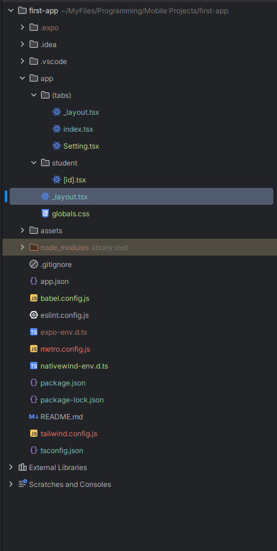

# learn-reactNative
## To Reset Your Project Run 

# (First You Must Setup the Nativewind in the project the steps in the pdf)⭐.

> This Will Delete all the code come with the project in first init and return it to be clean to code

```bash

npm run reset-project

```
## To make normal page with routing in app folder -> index.tsx :

> ``` index.tsx ``` Page

```tsx

import { Text, View } from "react-native";
import {Link} from "expo-router";

export default function Index() {
  return (
    <View className='w-full h-full flex justify-start items-center'>
        <View
            className='w-full h-full flex items-center justify-center'
        >
            <Text>Edit app/index.tsx to edit this screen.</Text>
            <Link
                className='px-8 py-3 bg-gray-400/20 border-2 border-gray-400 mt-4 rounded-md'
                href='/Setting'>
                Setting Page
            </Link>
        </View>
    </View>
  );
}

```

> ``` Setting.tsx ``` Page

```tsx

import React from 'react';
import {View , Text} from 'react-native';

function Setting(){
    return(
        <>
            <View>
                <Text>
                    Setting Page
                </Text>
            </View>
        </>
    )
}

export default Setting;


```


## We can make Dynamic Page Easily with React Native because it use as same as way in the next js in the project 

<ul>
  <li>
    app
  </li>
  <ul>
    <li>
      student
      <ul>
        <li>
          [id].tsx
        </li>
      </ul>
    </li>
    <li>
      index.tsx
    </li>
    <li>
      setting.tsx
    </li>
  </ul>
</ul>


> ``` student/[id].tsx ``` Page

```tsx

import {View, Text} from 'react-native'
import React from 'react'
import {useLocalSearchParams} from "expo-router";

export default function Students() {
    const {id} = useLocalSearchParams();

    return (
        <View>
            <Text>
                Welcome Student : {id}
            </Text>
        </View>
    )
}


```

> ``` index.tsx ``` Page


```tsx

import {Text, View} from "react-native";
import {Link} from "expo-router";

export default function Index() {
    return (
        <View className='w-full h-full flex justify-start items-center'>
            <View
                className='w-full h-full flex items-center justify-center'
            >
                <Text>Edit app/index.tsx to edit this screen.</Text>
                <Link
                    className='px-8 py-3 bg-gray-400/20 border-2 border-gray-400 mt-4 rounded-md'
                    href='/Setting'>
                    Setting Page
                </Link>
                <Link
                    className='px-8 py-3 bg-gray-400/20 border-2 border-gray-400 mt-4 rounded-md'
                    href='/student/Muhammed'>
                    Student Muhammed
                </Link>
            </View>
        </View>
    );
}

```


# Navigation

> To make Navigation in the app we must group the pages in group folder like ``` (tabs) ``` , within tabs folder we must put ``` _layout.tsx ``` file that return the ``` <Stack /> ```



> ``` app/(tabs)/_layout.tsx ``` Page


```tsx

import {StyleSheet, Text, View} from 'react-native'
import React from 'react'
import {Stack} from "expo-router";

const _Layout = () => {
    return (
        <Stack/>
    )
}
export default _Layout
const styles = StyleSheet.create({})


```

## To hidden the upper bar we gone to make this throw change the [_layout.tsx] files in the app directory & in the (tabs) directory :

> ``` app/(tabs)/_layout.tsx ``` Page


```tsx

import {StyleSheet, Text, View} from 'react-native'
import React from 'react'
import {Stack} from "expo-router";

const _Layout = () => {
    return (
        <Stack>
            <Stack.Screen
                name='index'
                options={{
                    headerShown: false,
                }}
            />

            <Stack.Screen
                name='Setting'
                options={{
                    headerShown: false,
                }}
            />

            <Stack.Screen
                name='student/[id]'
                options={{
                    headerShown: false,
                }}

            />

        </Stack>
    )
}
export default _Layout
const styles = StyleSheet.create({})

```


> ``` app/_layout.tsx ``` Page


```tsx

import { Stack } from "expo-router";
import './globals.css';

export default function RootLayout() {
    return <Stack >

        <Stack.Screen
            name='(tabs)'
            options={{
                headerShown: false,
            }}
        />

        <Stack.Screen
            name='(tabs)/student/[id]'
            options={{
                headerShown: false,
            }}
        />


    </Stack>;
}

```

> in the app we define the every folder we have as screen and in the the inner layout we define every file as screen
